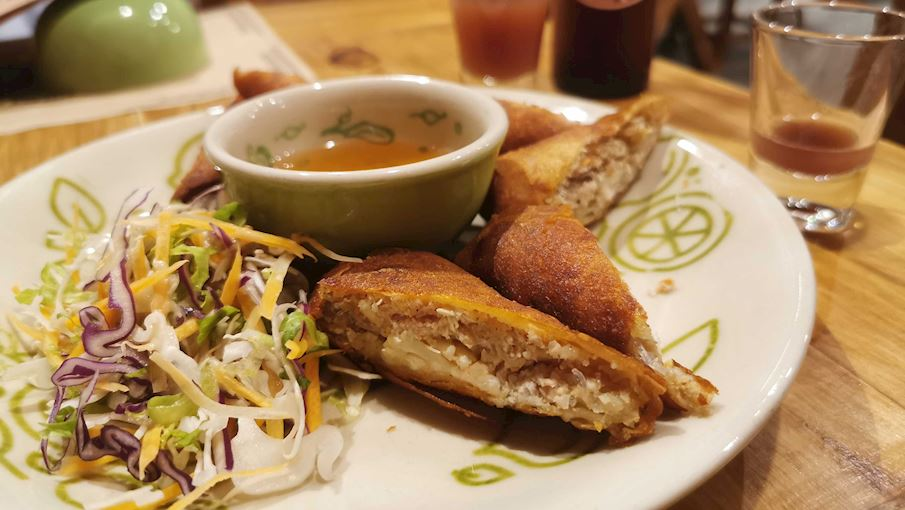
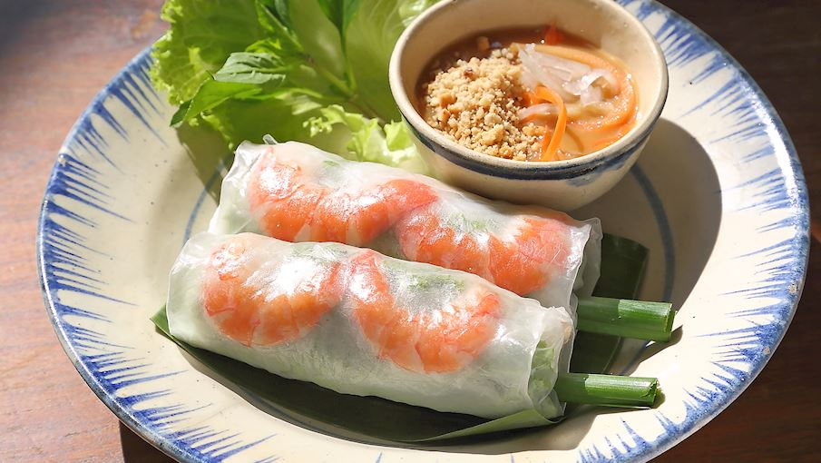
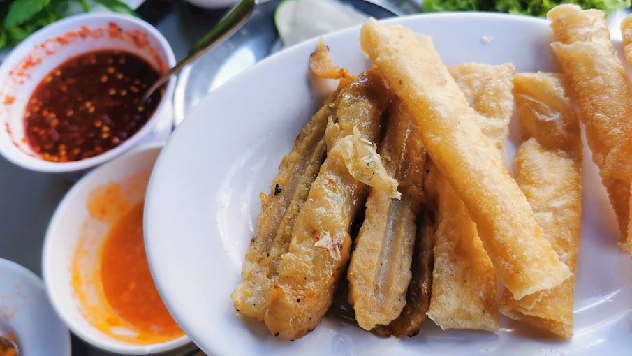

# HW1
There is a repo for the HW1

## Nguyen ThiThanhThuong & Ho GiaKhang

**Vietnamese Cuisine**

## Nguyen ThiThanhThuong

**Vietnamese Appetizers**

1. Fried Spring Rolls - Frequent additions to the stuffing include vegetables such as carrots, cabbage, or mushrooms, glass noodles, and bean sprouts.

2. Fresh Rolls - These crispy fressh rolls are prepared by wrapping soaked rice paper (bánh tráng) around various ingredients.

3. Grilled Pork Sausage - The sausage is usually made with a combination of ground pork fat and meat, garlic, fish sauce, shallots, sugar, black pepper, and often baking soda that's used for puffing up the meat.

*These appetizers rankings are based on the ratings of the TasteAtlas audience, with a series of mechanisms that recognize real users and that ignore bot, nationalist or local patriotic ratings, and give additional value to the ratings of users that the system recognizes as knowledgeable.*

**Notice**

Things need to notice:
- eat with suitable sauces
- eat when they are hot

Recipe Type: 
- Mordern
- Traditional

Other appetizers to go: 
[Vietnamese Appetizers](https://www.hungryhuy.com/vietnamese/appetizers/)

## Ho Gia Khang

**Main dishes**

For me, the main dishes of Vietnamese cuisine are incredibly diverse, so I have a lot of choices, among which there are three special dishes that I would like to share with everyone

1. Pho dat biet - Special Pho : Special combination beef rice noodle soup with rare and brisket beef, beef balls and stripe

2. Vermicelli - Bun Bo Hue, Beef soup with vermicelli Hue style

3. Rice Dishes -  Shredded pork, BBQ pork with steamed egg and steamed rice 

**Notice** 

These dishes should be accompanied by fresh vegetables, especially those with broth like Pho and Bun Bo Hue, along with special sauces for each dish such as hoisin sauce, fish sauce. Additionally, you can add chili if you want to enhance a bit of spicy flavor.